# **CUDA程序基本框架**

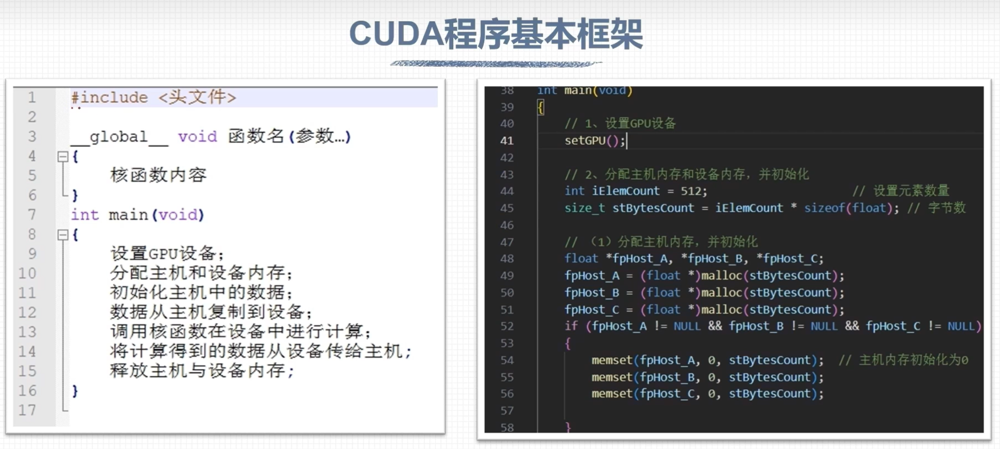

## 设置GPU设备

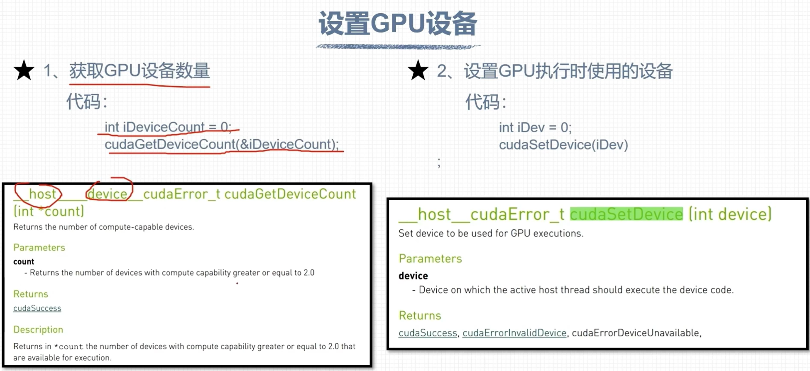

## 内存管理

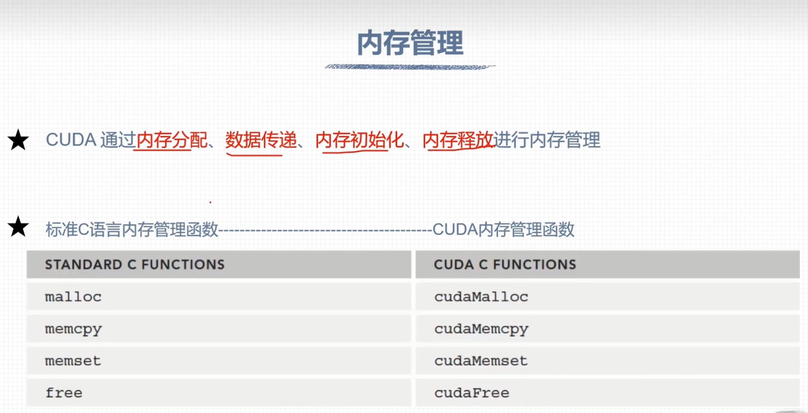

### 内存分配

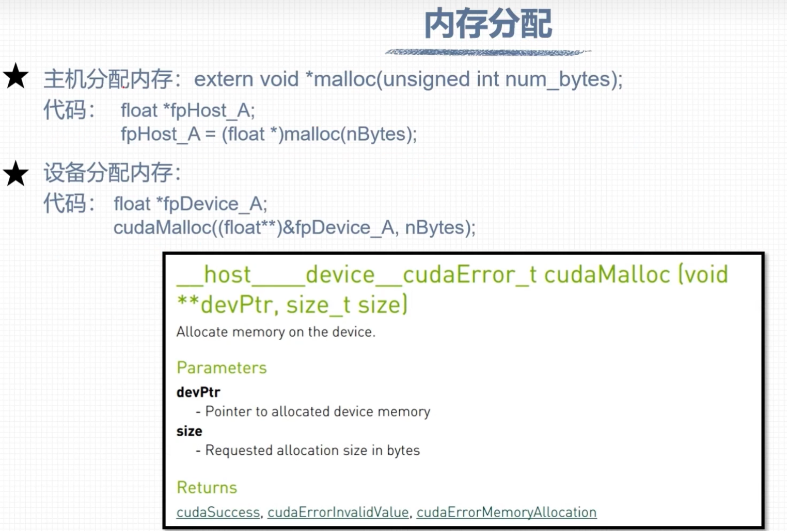

### 数据拷贝

### 内存初始化

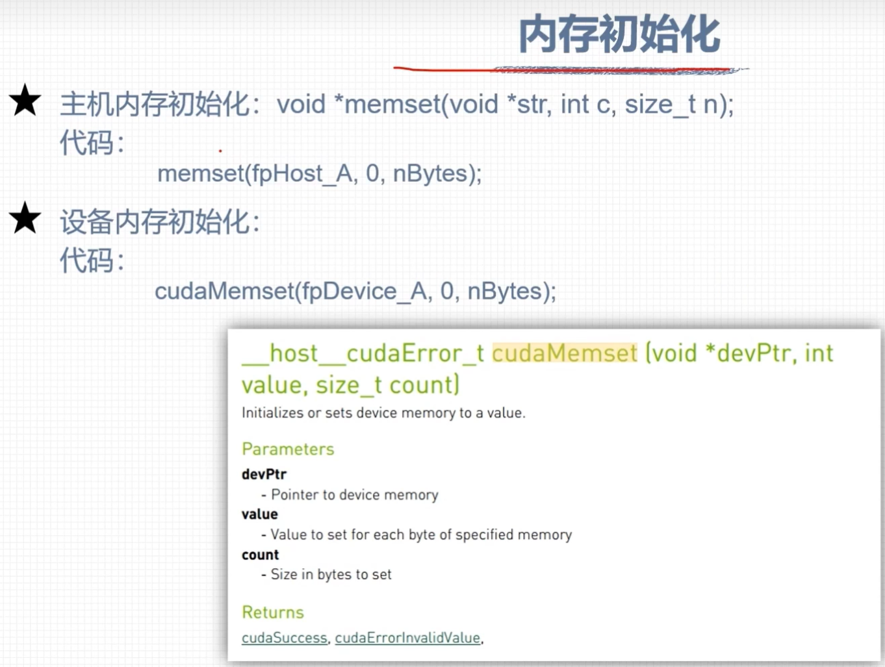

## 自定义设备函数

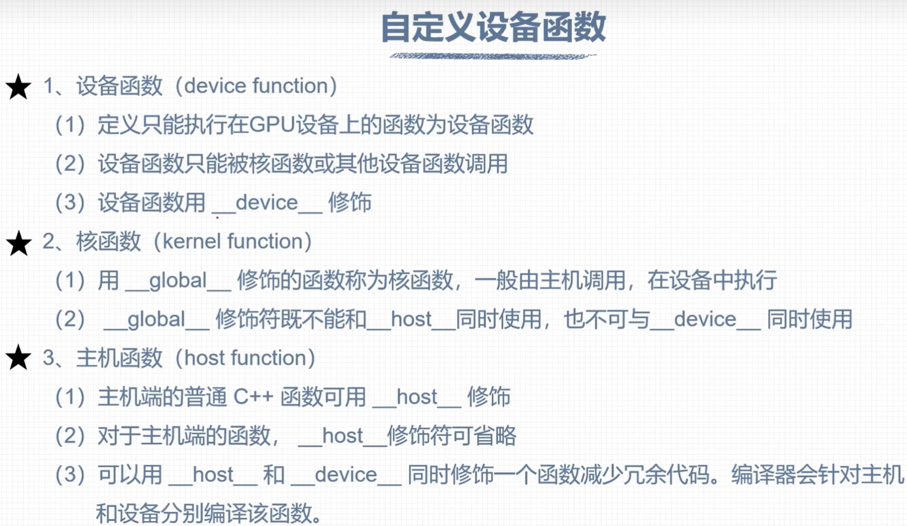

## 运行时API错误代码

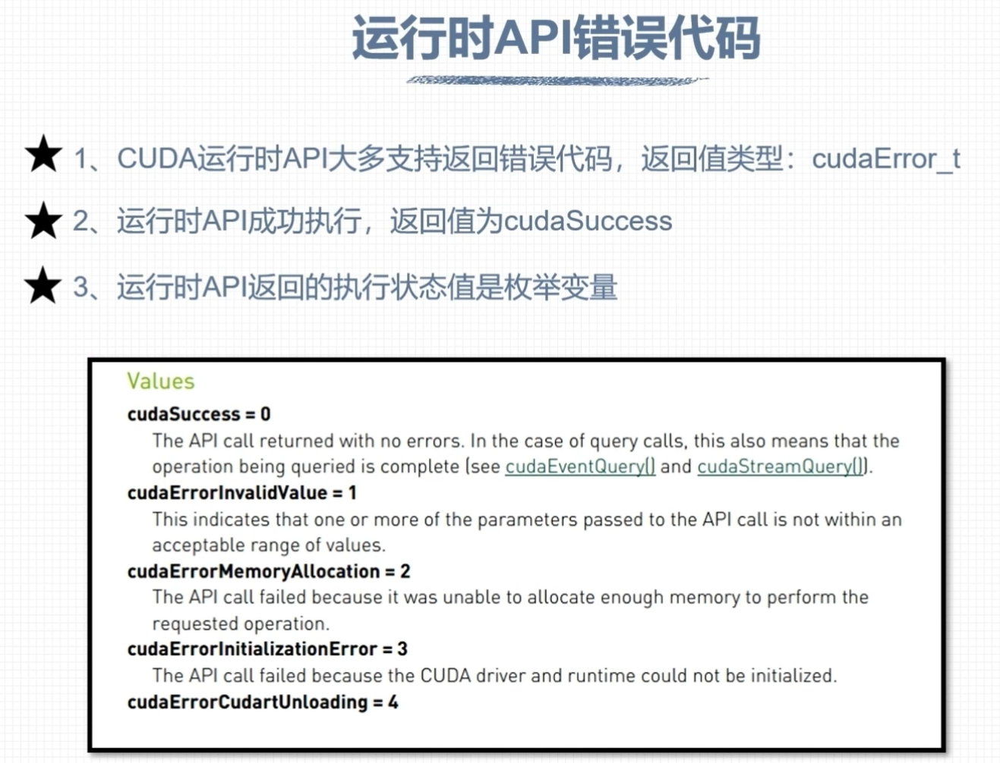

## 错误检查函数

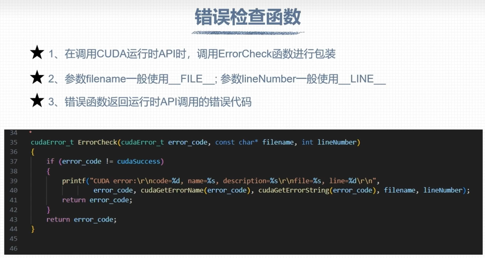

## 检查核函数

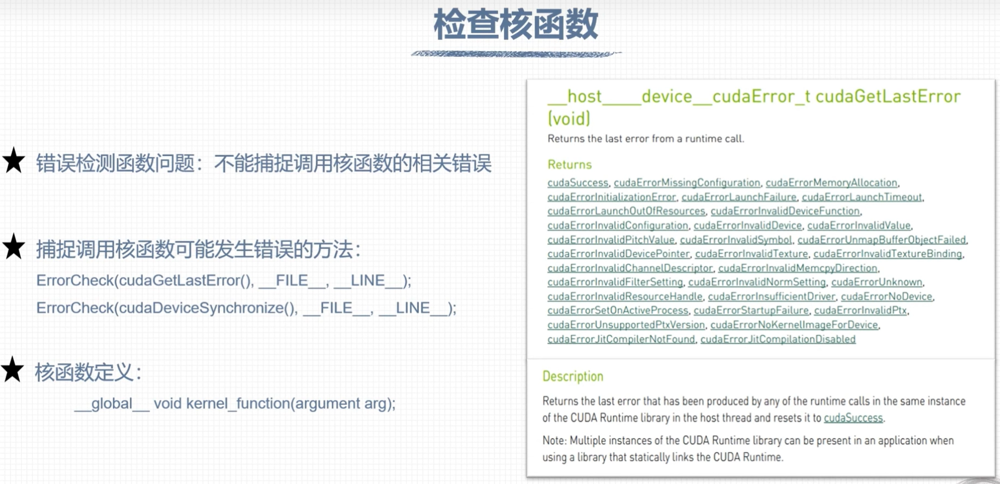

## 事件计时

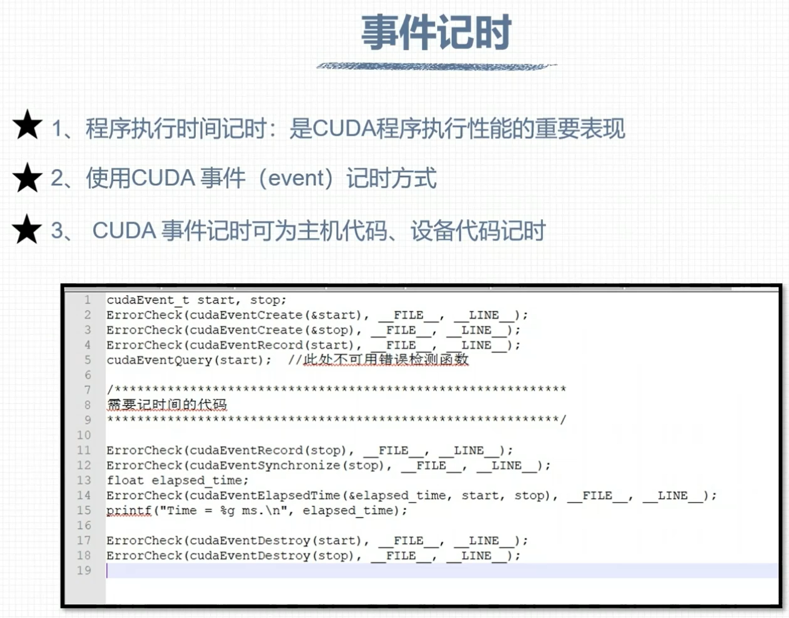

## nvprof性能分析

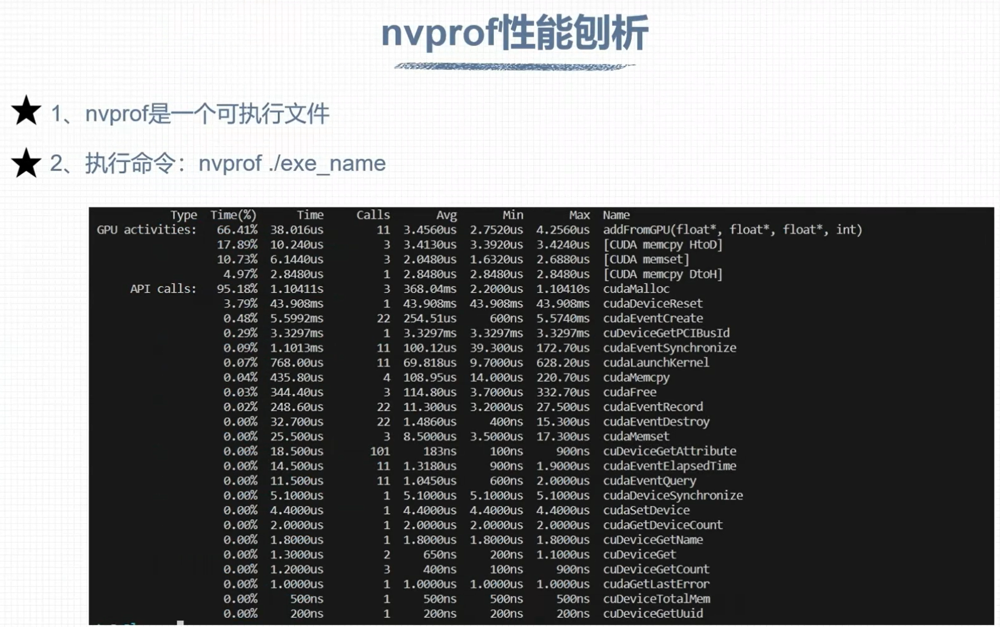

## 运行时API查询GPU信息

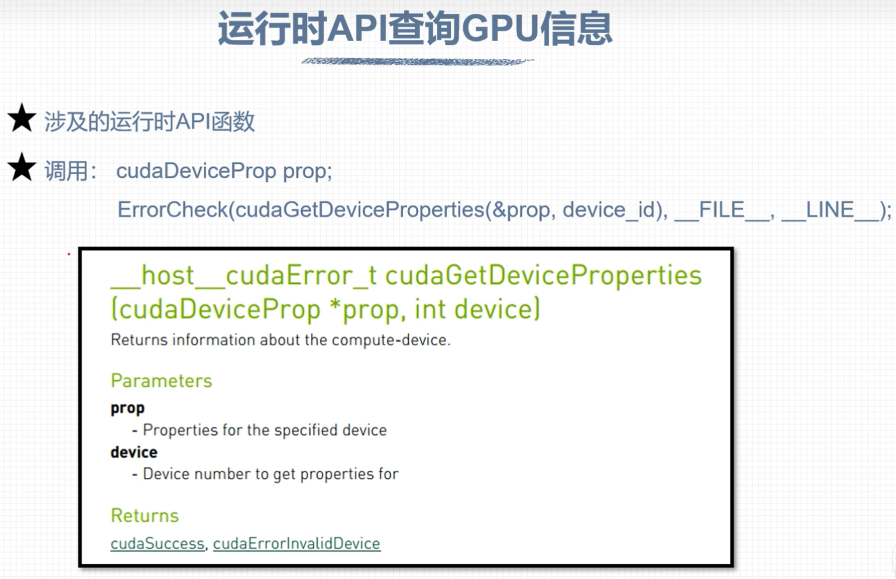

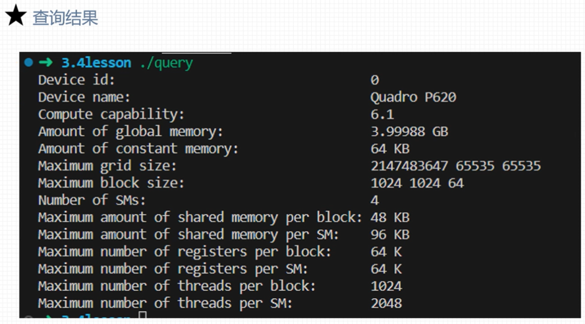

## 查询GPU计算核心数量

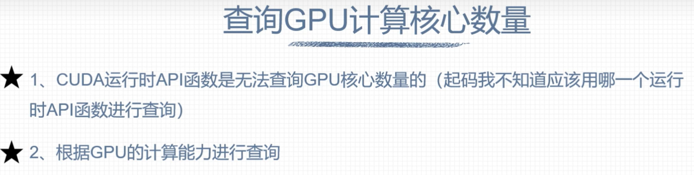

## 数据存储方式

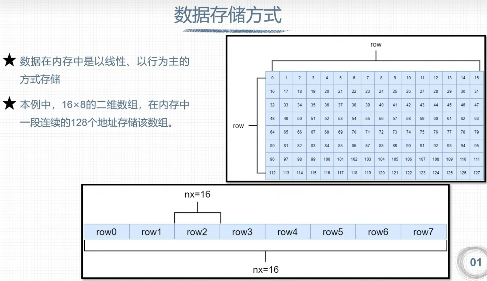

## 二维网格二维线程块

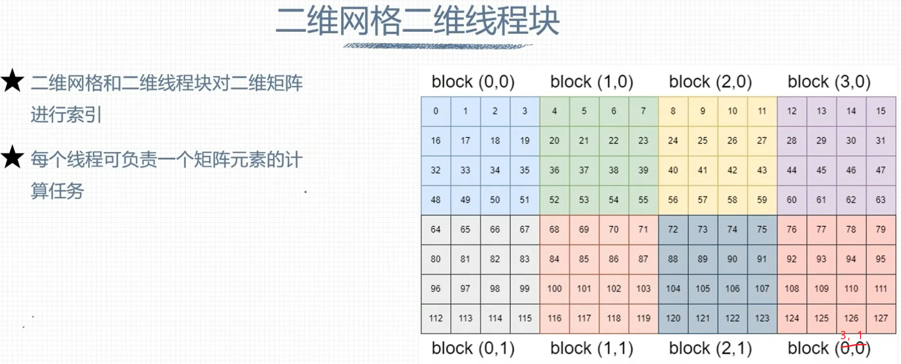

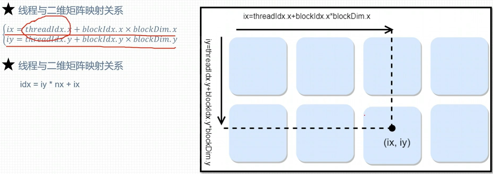

## 二维网格一维线程块

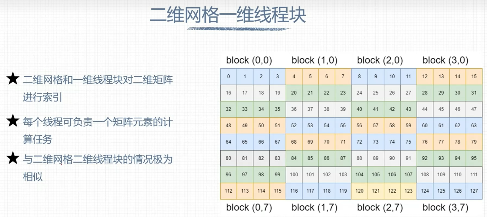
