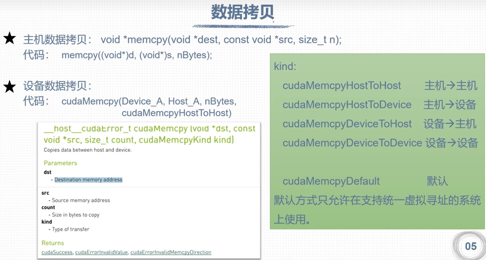

# **CUDA程序基本框架**

## 设置GPU设备

## 内存管理

### 内存分配

### 数据拷贝

### 内存初始化

## 自定义设备函数

## 运行时API错误代码

## 错误检查函数

## 检查核函数

## 事件计时

## nvprof性能分析

## 运行时API查询GPU信息

## 查询GPU计算核心数量

## 数据存储方式

## 二维网格二维线程块

## 二维网格一维线程块

